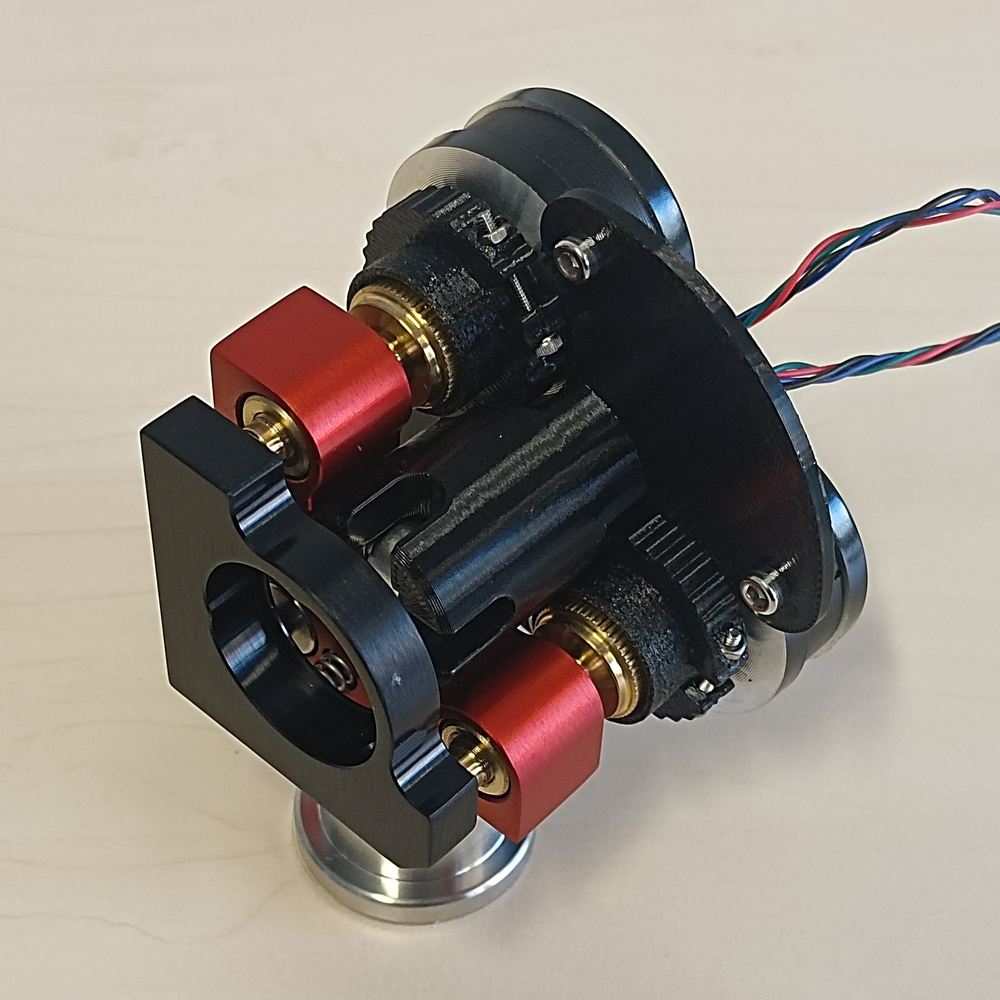
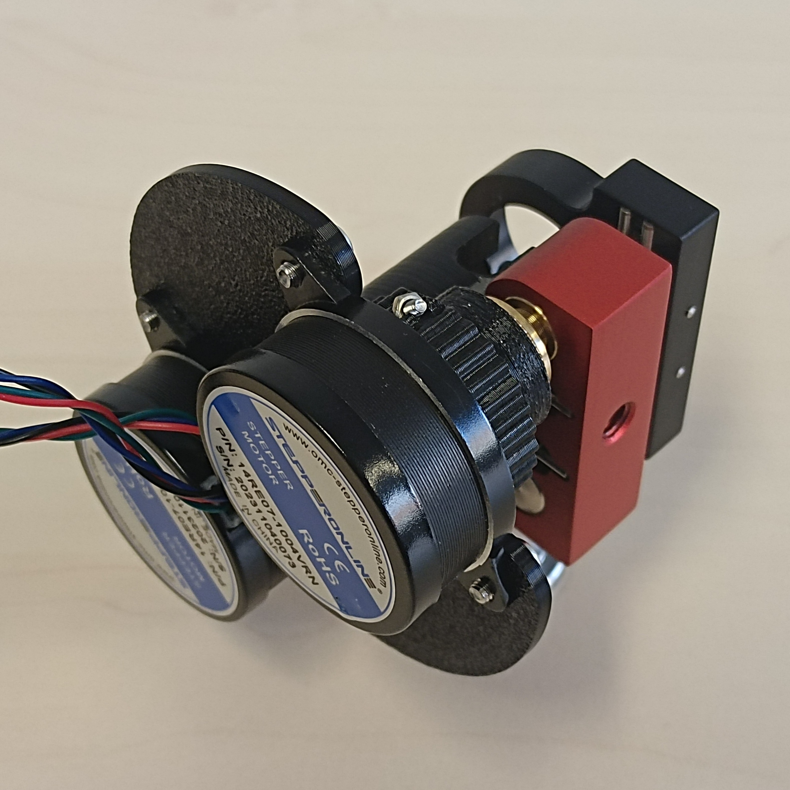
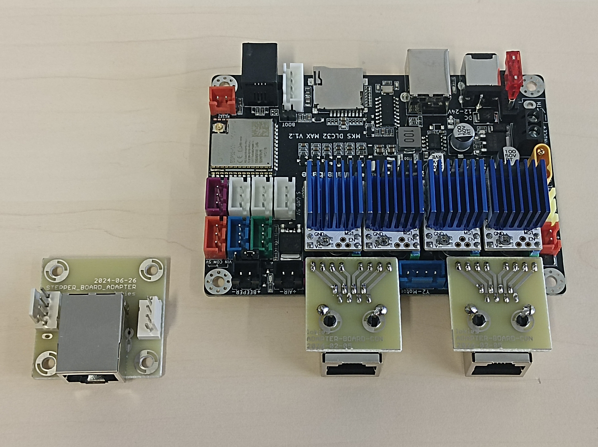
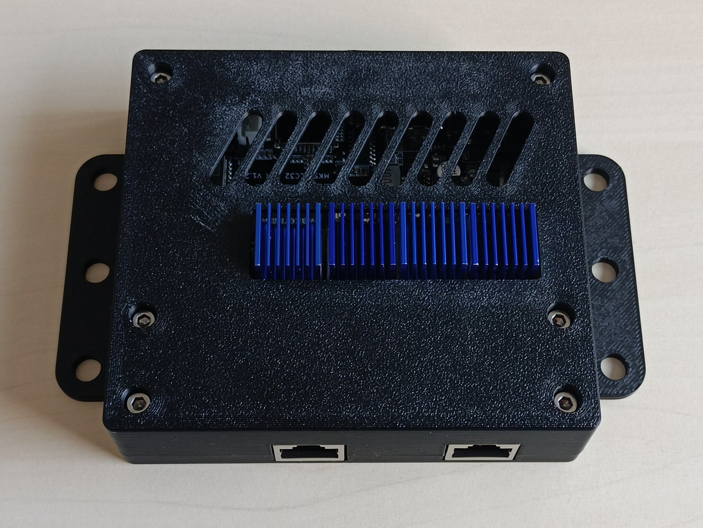

# DIY Motorized Mirror Mounts

_Lorenz Kies <[lorenz.kies@aei.uni-hannover.de](mailto:lorenz.kies@aei.uni-hannover.de)>_

_I designed this project during my employment as a research assistant at the Institute of Gravitational Physics at Leibniz University Hannover; it is therefore intellectual property of my employer, but I have been given permission to share it under an open source license._

 

## Introduction

Motorized mirror mounts for guiding laser beams are already an established commercial product, but their pricing makes them unreasonable for basic automation tasks for most people. This means they are mostly reserved for applications where remote control or precise repeatable positioning is required. This is why I decided to develop a low-cost alternative for cheap automatic alignment of optical experiments. Most commercial offerings start at around $1000 per axis (including the driver), or around $4000 for a full 4-axis system required for most alignment problems. In contrast, my design can be build for under $100 for a full set, so less than $25 per axis, relying mostly on standard components and 3D printed parts. Despite the low cost, the actuator performance is competitive with lower-end commercial products and more than sufficient for most automatic alignment problems.

If you want to simply build the actuators, go to the [Instructions](#instructions) chapter. Following that, I discuss some of the [mechanical](#mechanical-design) and [electrical](#electrical-design) design considerations I made, that may be of interest to you, if you want to modify the designs. Finally, I discuss the [characterization](#characterization) experiments and metrics used to evaluate the performance of the actuators.

## Table of Contents

- [Introduction](#introduction)
- [Instructions](#instructions)
  - [Parts List](#parts-list)
  - [Actuator Assembly Instructions](#actuator-assembly-instructions)
  - [Electronics Setup](#electronics-setup)
  - [Firmware Setup](#firmware-setup)
  - [API / Software Setup](#api--software-setup)
- [Design Considerations](#design-considerations)
  - [Mechanical Design](#mechanical-design)
  - [Backlash and Hysteresis Compensation](#backlash-and-hysteresis-compensation)
  - [Electrical Design](#electrical-design)
- [Characterization](#characterization)
  - [Minimal Incremental Motion](#minimal-incremental-motion)
  - [Unidirectional Repeatability](#unidirectional-repeatability)
  - [Nonlinearity](#nonlinearity)
  - [Backlash](#backlash)
  - [Backlash Variation](#backlash-variation)
  - [Interpretation](#interpretation)
  - [Results](#results)

## Instructions

These are the instructions to build the `pancake-direct-v2` design, which is the recommended design. The other designs are mostly included for completeness' sake, if you want to build them you will have to figure it out yourself from the CAD files.

### Parts List

To build a set of **four actuators** on two **mirrors**, you will need the following parts:

| Electronic Parts | Quantity |
| - | - |
| [NEMA 14 Pancake Stepper Motor](https://www.omc-stepperonline.com/de/e-serie-runden-nema-14-bipolar-0-9deg-8ncm-11-33oz-in-1-0a-36x17mm-4-draehte-14re07-1004vrn) | 4 |
| [TMC2208 StepStick V1.2](https://aliexpress.com/item/33045459259.html) | 4 |
| [Makerbase MKS DLC32 MAX](https://aliexpress.com/item/1005008204547315.html) | 1 |
| [19V 5A Power Supply (5.5mm x 2.5mm socket)](https://de.rs-online.com/web/p/steckernetzteile/2552119) | 1 |
| [Cat7 U/FTP 2m Ethernet Cable](https://de.rs-online.com/web/p/ethernetkabel/2660713) (optional) | 2 |
| [Adapter-Board-Stepper](electrical/adapter-board-stepper) (optional) | 2 |
| [Adapter-Board-Controller](electrical/adapter-board-controller) (optional) | 2 |

The links for the motors, motor drivers, and driver board are not affiliate links, they are simply the first results I found. All parts are also offered by many other suppliers. If you can not find the exact same model, you should also be able to use similar parts that perform the same function.

There are a lot of other CNC driver boards out there, many of them ESP32 based. Alternatively, it is also not too difficult to build one yourself. Similarly, you can also use different stepper drivers like the TMC2209, DRV8825 or A4988. Most stepsticks are pin compatible at least to the extent required for basic operations. If you choose to buy TMC2208 stepsticks, I recommend getting the white v1.2 version, there are many step stick designs available and some of them seem to have weird factory side configurations. Although 15V and 3.5A should technically be enough for the power supply, I recommend staying on the safe side and getting a more powerful one like the one specified. If you do not have the capabilities to manufacture PCBs, you can also buy [RJ45](https://de.aliexpress.com/item/1005004520312413.html) breakout boards instead of the custom adapter boards, or skip the Ethernet cables entirely.

| Mechanical Parts | Quantity |
| - | - |
| [MDI-HS Mirror Mount](https://www.radiant-dyes.com/index.php/products/optomechanics/high-stable-mirror-mounts/131-mdi-hs) | 2 |
| DIN 912 M2x16mm | 4 |
| DIN 934 M2 Nuts | 4 |
| DIN 912 M3x6mm | 8 |
| DIN 912 M4x12mm | 4 |
| DIN 912 M6x16mm | 2 |

In most cases, it is not necessary to use DIN 912 of these exact lengths, just use whatever is available.

| 3D Printed Parts | Material | Quantity |
| - | - | - |
| [`gear-grip.stl`](mechanical/pancake-direct-v2/gear-grip.stl) | PETG | 4 |
| [`screw-grip.stl`](mechanical/pancake-direct-v2/screw-grip.stl) | TPU 95A | 4 |
| [`fastener.stl`](mechanical/pancake-direct-v2/fastener.stl) | PETG | 4 |
| [`mount-plate.stl`](mechanical/pancake-direct-v2/mount-plate.stl) | PETG | 2 |
| [`mount-stem.stl`](mechanical/pancake-direct-v2/mount-stem.stl) | PETG | 2 |
| [`adapter-board-mount.stl`](mechanical/adapter-board/adapter-board-mount.stl) (optional) | PETG | 2 |
| [`driver-board-case-lower.stl`](mechanical/driver-board-case/driver-board-case-lower.stl) (optional) | PETG | 1 |
| [`driver-board-case-upper.stl`](mechanical/driver-board-case/driver-board-case-upper.stl) (optional) | PETG | 1 |

Other materials like PLA instead of PETG or other flexible filaments instead of TPU 95A will probably also work, this is just what I used. If you have access to a laser cutter, you can also cut the [`mount-plate.dxf`](mechanical/pancake-direct-v2/mount-plate.dxf) out of 2.5mm to 3mm thick acrylic. This is a bit stiffer and looks nicer.

### Actuator Assembly Instructions

1. Crimp a plug to the wires, make sure that the first two wires are one phase and the second two wires are the other phase, do not mix them. The polarity and positioning of the phases determine the rotation direction, but this does not really matter for most applications.
2. Insert M2 nut into `fastener`. If it does not fit, heat the nut using a lighter or soldering iron. If it does not sit tight, heat the plastic and press it together around the nut. Alternatively, hose clamps might also work well for this, but I did not test that.
3. Put the `gear-grip` on the output gear of the motor. If it is too tight, slightly bend the two halves apart. The part has a chamfer on one side that should also help with this.
4. Put the `screw-grip` on the `gear-grip`, make sure that the shallow slots in the `gear-grip` align with the shallow notches on the `screw-grip`.
5. Push the `fastener` onto the `gear-grip`, if it is too tight, slightly bend the `fastener` apart. The `fastener` has a chamfer that should mate with a very thin shoulder on the `screw-grip` to help with the alignment.
6. Before tightening the fastener, use a knife (or another thin piece of metal) to make a small gap (~0.5mm) between the motor and `gear-grip` to avoid unnecessary friction between the two.
7. Tighten the fastener using an M2x16mm screw. If the M2 nut in the `fastener` breaks free, use pliers to hold it in place while tightening.
8. Repeat steps 1-7 for the other three motors.
9. Fasten the `mount-plate` to the `mount-stem` using two M4x12mm screws. Repeat for the other mount.
10. Place two motor assemblies on their back with the wires facing inwards. (Not really necessary, but it looks nicer in my opinion.)
11. Fasten the `mount-plate` / `mount-stem` assembly onto the two motors using four M3x6mm screws. Repeat for the other mount.
12. Put a M5x16mm screw through the hole of the mirror mount that is **not** used for screwing it to its foot. Screw it in so that the head is roughly in the center of the optical axis.
13. Place the whole mirror actuator assembly onto the mirror mount and tighten the M5 screw. Repeat for the other mount. When setting up the mounts as part of a setup, I recommend doing the placement and rough alignment without the actuator assembly attached, and only attaching it for fine automatic alignment.


### Electronics Setup

1. For each of the red DIP switches between the stepstick slots, switch them all to the down/off position to select 8 microsteps per full step.
2. Plug the stepsticks into the driver board. Most stepsticks have some of the pins labeled _somewhere_ so you know which way around to plug them in.
3. If you built the adapter boards, plug them in. Beware, many CNC driver boards have two sockets for the y-axis, make sure to skip the second one.
4. **With the motors disconnected**, connect the power supply and adjust driver current reference voltage as described in the ["Motor Current Setting"](https://wiki.fysetc.com/docs/TMC2208#Motor%20Current%20Setting) section. I set it to 800 mV which indicates an RMS current of 800 mA. This may be slightly different for other stepstick designs. The drive current is a tradeoff between torque and heating. With a larger current, the motor can produce more torque and consequently move at higher speeds. However, it will also heat up faster and reach higher temperatures. The TMC2208 has an auto power-down feature that reduces the current during standstill. If you have this feature and use the motors infrequently enough, you may get away with higher currents without overheating. The motors are rated for 1.0 A per phase, so with 800 mA, should be on the safe side.
5. Attach the driver board adapters to the driver board and put the assembly in the case and close it with six DIN 912 M3x20 screws.

 

### Firmware Setup

1. Install Python in your preferred way.
2. Install [`esptool`](https://pypi.org/project/esptool/) for example using pip:

    ```shell
    pip install esptool
    ```

3. Download the [firmware image](firmware/firmware.bin).
4. Erase the flash memory of the controller board using:

    ```shell
    esptool --chip esp32s3 erase_flash
    ```

    If you have multiple serial devices connected, you may also need to specify the port using `--port COM[X]` on Windows or `--port /dev/ttyUSB[X]` on Linux.

5. Flash the image using:

    ```shell
    esptool --chip esp32s3 write_flash 0x0 firmware.bin
    ```

    The same note about the port applies here as well.

If you are using a different board, you will need to configure the correct pins and potentially switch the build system different architecture. You can find more details on this in the [`firmware` directory](firmware).

### API / Software Setup

1. Install Python in your preferred way.
2. Install the API package from source control using pip:

    ```shell
    pip install git+https://github.com/lkies/motorized-mounts.git#subdirectory=api
    ```

3. Control the steppers through a `StepperBoard` instance:

    ```python
    from stepper_board import StepperBoard, RpcClient, SerialBLS

    # the default baudrate of ESPs is 115200
    with SerialBLS.connect("COM[X]", 115200) as bls:
        # create proxy instance of stepper board connected to serial port
        steppers = StepperBoard(RpcClient(bls))

        # configure speed, acceleration and compensation settings
        # only needed once, the settings are saved the board's non-volatile memory
        for i in range(4):
            steppers.set_max_speed(i, 500)
            steppers.set_max_accel(i, 1e5)
            steppers.set_backlash(i, 10) # in case you want to use backlash compensation
            steppers.set_hysteresis(i, 30)
            steppers.set_compensation("hysteresis")

        # enables the stepsticks
        steppers.set_enabled(True)

        # move stepper 0 to position 1000 microsteps
        steppers.move_to(0, 1000)

        # move multiple steppers simultaneously
        steppers.move_to_vec([10, 20, 30, 40], "joint_max") 
    ```

The configuration only needs to be done once, the settings are stored on the chip's non-volatile memory and it is automatically reloaded at startup. From the characterization measurements, the backlash compensation should be about 10 microsteps at 8 microsteps per full step. The hysteresis compensation needs to be at least as large as the maximum backlash, in this case, greater than about 15 microsteps. To be on the safe side, we choose 30 microsteps. A larger hysteresis correction will cause more unnecessary extra movement, but at these small scales, it does not really matter. The best performance is achieved with hysteresis compensation, so unless you have a good reason to use backlash compensation, I would recommend using hysteresis compensation.

You can find more information about the driver boards behavior in the [`api` directory](api).

_Please consider providing feedback on the build process if you end up replicating this design so that we can optimize the instructions and the design itself. Have Fun!_

## Design Considerations

### Mechanical Design

Building a stable and robust mirror mount is not a trivial task. That is why I did not do it and instead built the design around the [MDI-HS](https://www.radiant-dyes.com/index.php/products/optomechanics/high-stable-mirror-mounts/131-mdi-hs) series mirror mounts from Radiant Dyes. They have proven themselves as reliable and stable mirror mounts in our labs. They also have slightly larger thumbscrews than other mounts, which is helpful in reducing coupling slack between them and the motor.

For the motors, I experimented with two different types of stepper motors: the extremely cheap 28BYJ-48 geared stepper motors and the slightly more expensive [Nema 14 Pancake motors](https://www.omc-stepperonline.com/de/e-serie-runden-nema-14-bipolar-0-9deg-8ncm-11-33oz-in-1-0a-36x17mm-4-draehte-14re07-1004vrn) (400 step/rev version). The 28BYJ-48 motors are normally unipolar stepper motors, but they are not too difficult to [modify for bipolar operations](https://ardufocus.com/howto/28byj-48-bipolar-hw-mod/). This has two advantages: first, bipolar operation is not limited to using half the coil windings, which means more torque. Second, and much more importantly, it is much easier to get good microstepping drivers for bipolar motors, such as the TMC2208. This is very important because the excess vibration caused by bad drivers causes a lot of problems with sensitive optical experiments.

One simple method for increasing the actuation resolution of an actuator is to use a gear reduction. However, this may not always lead to better performance since the gearing also introduces backlash and other hysteresis-like effects. To investigate this, I designed a geared and a direct drive version for both motors. Typically, gearboxes, especially stiff metal gears, are intentionally designed with some slack to prevent jamming and allow for lubrication, but this also means that they will have backlash. Without this play, even tiny manufacturing tolerances can reduce the slack "below zero" which then requires strong deformation forces to move past, if possible at all. This is not as critical in plastic gears, which allow for more deformation. In fact, we can deliberately introduce radial compliance in the gear, which then allows us to preload them without the risk of jamming and excessive required forces to move. With this, we can effectively eliminate backlash, but the compliance itself may introduce other hysteresis-like effects.

Another challenge is to provide a reliable coupling between the motor and the mount. While a form fit is generally good for preventing slippage, it requires precise manufacturing to match the mating part. In addition to that, the stiff coupling requires the axis of the mount to be very well aligned with the axis of the motor, otherwise the mechanism may not be able to move freely. Because of these reasons, I choose to use a friction fit with TPU 95A, providing the required compliance. This has a few advantages, firstly, the compliance allows for slight radial misalignments by deforming. The knurled knob provides good grip for torque transfer while still allowing for some axial slip to deal with the screw moving in and out of the mount as it is actuated. And finally, it is easy to manufacture on most 3D printers and does not require additional elements like grub screws. The major disadvantage is that there will be additional hysteresis-like effects. In practice, this does not seem to be very severe, although it is possible that it is currently a limiting factor on the minimal incremental motion.

### Backlash and Hysteresis Compensation

While there is only one way for an actuator to be "perfect", i.e. a simple linear mapping from desired position to actual mirror orientation, there are many ways in which an actuator can be imperfect. Here is a list of the types of imperfections investigated and possible compensation approaches. You can find more details about how we characterized them in the [Characterization](#characterization) section.

- Minimal Incremental Motion: This is the smallest unidirectional change in position that the actuator can reliably produce. Changes in input that are smaller have no meaningful effect on the output due to digital resolution limits, stick-slip effects or limitations in the drive train.
- Backlash: It is commonly defined as "the maximum distance or angle through which any part of a mechanical system may be moved in one direction without applying appreciable force or motion to the next part in mechanical sequence." For our purposes, we can define it as the additional change in input we need to apply after a direction change before the output starts to change. If this is consistent, it can be compensated for by adding that amount to the input when changing direction.
- Backlash Variability: If the backlash is not consistent over the actuator's range of movement, it can not be compensated for with simple backlash compensation. However, if it is consistent for a given position, we can compensate for it by always approaching the desired position from the same direction. With this approach, we can also compensate for any other hysteresis-like effects, so we will call it hysteresis compensation as opposed to the simple backlash compensation. Hysteresis compensation is generally more robust and leads to better accuracy because it compensates for more imperfections and does not require precise knowledge of the backlash. However, it is slower since it requires extra movement to approach the desired position from the correct direction.
- Macroscopic Nonlinearity: Besides the small-scale nonlinear behavior described by the minimal incremental motion, there may also be macroscopic nonlinearities due to non-ideal components in later stages of the transmission. These could be compensated for by calibrating them out, but this is generally not necessary for automatic alignment applications where precise repeatable movement is much more critical.

### Electrical Design

The stepper motors are a crucial part for providing precise, repeatable actuation. To get the best performance out of them, it is important to use good stepper drivers. I chose the TMC2208 drivers because of their quiet and vibration free stealth chop mode to avoid disturbing sensitive optical experiments, but other drivers might also be good enough and are usually pin compatible if integrated onto a stepstick. To drive them I used an ESP32 (old or S-series) because of their high resolution timers and established ecosystem. While it is not too hard to design a PCB that connects the microcontroller to the four stepsticks, it is superfluous because this kind of problem has been solved many times before for CNC machines, 3D printers and laser cutters. There are a lot of these boards out there, and quite a few of them even use the ESP32 based controllers. I selected the Makerbase MKS DLC32 MAX V1.2 because it is compact and cheap (<20€ on AliExpress) and has the required four stepper driver slots and ESP32s3 controller. Sadly, the schematics are not open source, but the [pinout](https://github.com/user-attachments/files/19184922/MKS.DLC32.MAX.V1.0_002.PIN.pdf) can be found online.

I wrote my own firmware that implements speed and acceleration limits, as well as backlash and hysteresis compensation, with a simple JSON-based serial interface to control it. But it might be interesting to investigate using established software like [GRBL](https://github.com/grbl/grbl) to simplify the project even further.

While the motors I used do not require much power, I would still recommend using a power supply with more than 15V. At high speeds, the inductance becomes the limiting factor in how much current can flow. If the driver has a higher voltage supply, it can change the current through the inductor faster to maintain reasonable torque at high speeds. But be careful setting the current limit on the drivers, they can easily overheat and potentially damage the 3D printed parts.

Since you will most likely not want to mount the controller board on your optical table, you will need to extend the motor wires somehow. For this, I recommend using Ethernet cables. With four twisted pairs, a single Ethernet cable can drive two stepper motors, enough for the two axes of a single steering mirror. Another advantage of using Ethernet cables is that they also shield the individual motor wire pairs preventing electromagnetic interference from the comparatively high drive currents. While more shielding might sound attractive, especially considering the current going through these wires, I still recommend using U/FTP cables because they are typically much more flexible than cables with overall shielding. To go from the driver board to RJ45 and back at the mirrors, we use custom adapter boards, but you can also buy RJ45 breakout boards if you do not have the capability to make your own.

## Characterization

To measure the performance of the actuators, we use one simple experiment and multiple evaluations to extract the quantities of interest from the data. The experimental setup is very straightforward, we shine a laser beam at the mirror of the mount to be evaluated and then measure the changes in position on a screen. The position which is approximately proportional to the change in mirror angle is measured using the difference voltage of a four quadrant photodetector, while this is not linear in the position, the nonlinearity is easy to calibrate out. We then move the actuator back and forth multiple times and record the input and measured output position. After each movement, we wait for 100 ms for the mount and table to settle to get as precise a measurement as possible. All performance metrics are then derived from this data.

Example code for computing the quantities can be found in the [plotting notebook](images/plots/plots.ipynb). The actual code used is slightly different and can be found in the [evaluation module](characterization/evaluation.py). To better illustrate the individual effects, the example plots shown are based on simulated data which is also generated in the plotting notebook.

### Minimal Incremental Motion

In a loose sense, the minimal incremental motion is the smallest change in input, that reproducibly leads to a change in output. To quantify it we look at small segments of the unidirectional travel, where other nonlinearities are negligible. We compute the mean expected movement using a unity slope linear regression line and then look at the distribution of the residuals. Ideally, the span of the distribution i.e. max - min then gives us the minimal change in input that we need to apply to get a reliable change in output. In practice, the measurements are subject to noise and so maximum and minimum values are most likely outliers which are not representative of the expected performance. We can mitigate this by only looking at the inner $x$ percent of values. For example if we want to take the inner 95% of values we use the 2.5th and 97.5th percentile instead of the minimum and maximum.

We can get estimates of the confidence intervals by bootstrapping the distribution of residuals.

<image src="images/plots/min_increment.png" alt="Minimal Incremental Motion Plot" width="400px"/>

The plot shows minimal incremental motion limited by stick slip effects. For most small changes in input, the system "sticks" and the changes in output are purely noise. Once the input change is large enough, the system "slips" and the output changes suddenly. Because of this, the system can not be controlled at scales finer then the "steps" of the slips.

### Unidirectional Repeatability

In addition to the mostly consistent stick-slip effects that limit the minimal incremental motion, there may be other randomized effects that cause the actuator's output to differ between multiple repetitions of the same input. We call this unidirectional repeatability. This is in contrast to bidirectional repeatability, which is usually limited by backlash and backlash variation. We determine it by examining the peak-to-peak deviation in output across multiple repetitions of the same input, while accounting for movement direction. And again, to account for measurement noise, we do not use the maximum and minimum values but instead use percentiles for greater robustness against noise and outliers. By only comparing against points with the same input and direction as opposed to a linear regression line, this metric is independent of nonlinearity or backlash.

<image src="images/plots/unidirectional_repeatability.png" alt="Unidirectional Repeatability Plot" width="400px"/>

Moving through the same segment multiple times, we see that the output randomly ends up in slightly different positions, limiting the achievable accuracy.

### Nonlinearity

Ideally, after accounting for backlash and minimal incremental motion, there should be a linear relationship between input and output position. In practice, this might not be the case due to manufacturing tolerances across various parts of the drive train. To quantify this, we look at motion across a large segment of the travel and compute the residuals to a linear regression. Similar to minimal incremental motion, instead of directly using the minimum and maximum values, we use percentiles to mitigate the effects of outliers.

<image src="images/plots/nonlinearity.png" alt="Nonlinearity Plot" width="400px"/>

The input-output relationship is not perfectly linear. A user or application that assumes linear behavior will see a systematic deviation from the expected output corresponding to the nonlinearity.

### Backlash

In general, hysteresis is the dependence of a system's state on its history. In the context of actuators, this usually means whether we previously moved the actuator in the same direction or not. In more complicated cases, the behavior may also depend on how long ago the last change in direction was. The dominant source of hysteresis effects in mechanical systems is usually backlash. It is the consequence of play in the force-transmitting elements of the actuator. When we change direction, parts with play need to move through a dead zone before they make contact again and start transmitting force. We defined backlash as the additional movement we need to apply to the actuator after changing direction before the output begins to change.

To determine the backlash from measured data, we can perform a virtual backlash compensation during measurement post-processing. For this, we split all movement segments into forward and backward motion. Then we then shift the recorded input values of the backwards motion by the amount of backlash to compensate for. Finally, we delete the datapoints in the dead zone after changes in direction. We define the backlash as the compensation value that maximizes overlap between the forward and backward segments. In the process, we also get backlash-compensated data that we can use for other evaluations.

Alternatively, we can also determine the backlash as the negative of the signed integral of the hysteresis loop in the input-output space relative to the maximum change in output position (i.e. change in input minus backlash). The advantage of this method is that it does not require a metric to compute the overlap between forward and backward segments. The downside is that we always need to integrate over full hysteresis loops to get valid results. Additionally, we also do not get backlash compensated data for other evaluations.

In both of these evaluations, we compute the backlash in terms of the input position. However, we are usually interested in the backlash in terms of output position. For this, we just multiply it by the input-output proportionality.

It is important to note that it is a matter of convention that we choose the forward direction to be the true direction and the backward direction to be the one affected by backlash. We could just as easily select the backward direction to be the true direction or any mix of the two and split the backlash compensation between the two. However, there is an output offset between the different conventions. The driver board considers the forward direction to be the true direction and applies the backlash compensation to the backward direction, so we stick to this convention for consistency.

We can get confidence intervals by computing the backlash for each cycle individually and then using standard t-statistic-based confidence intervals.

<image src="images/plots/backlash.png" alt="Backlash Plot" width="400px"/>
When changing direction, there is a dead zone before the output starts to change again. This means that the output position is consistently to hight when moving backwards. By shifting the recorded input values for all backwards motion and cutting out the dead zone after direction changes, the forward and backward trajectories overlap again.

### Backlash Variation

While constant backlash is not too difficult to compensate for by adding a constant bias after a direction change, this does not work for variable backlash. In that case, compensating for an average backlash will lead to overcompensation in some cases and undercompensation in others. Quantifying this is somewhat messier than the other metrics, as we need a way to determine the local backlash. To get a reasonable estimate of the local backlash, we need to be able to determine the input deviation between the forward and backwards trajectories for the same output positions. To provide a balance between resolution and smoothing, we interpolate using a Gaussian kernel with a bandwidth equal to the average spacing between consecutive outputs. We then collect all deviations between forward and interpolated backwards or backwards and interpolated forward trajectories. From these deviations we can then again compute lower and upper quantiles to get noise-robust estimates of the differences between maximum and minimum values.

<image src="images/plots/backlash_variation.png" alt="Backlash Variation Plot" width="400px"/>

The backlash is not consistent across the range of movement. After compensating for the average backlash, the range with small backlash is overcompensated and the range with large backlash is undercompensated. This leads to a systematic deviation from the expected output that depends on the position of the actuator.

### Interpretation

An obvious question that arises when looking at these metrics and comparing different motors is, which of these metrics actually matter? The annoying answer here is, it depends on the application and the compensation mode or lack thereof, that is used. For this, we need to introduce the terms of accuracy and precision, which we will call repeatability, to avoid confusion with accuracy. Accuracy describes the deviation of the _expected_ output (i.e., averaged across many iterations) from the true (linear) relation, or, in a looser sense, whether the average output is correct. Precision or repeatability describes the deviation of individual measurements between multiple repetitions of the same input, or in a looser sense, is the actuator consistent. So accuracy or lack thereof is a matter of systematic errors, while repeatability is a matter of random errors. Even though backlash and backlash variation are technically deterministic, we will treat them as random errors for measures of repeatability, as they can appear random to a user or algorithm that is not aware of the history of the actuator.

With this, we can specify the expected performance for different compensation modes. The specified values are bounds for worst-case deviations, discounting errors from noisy measurements and extreme outliers (because we used percentiles instead of maximum and minimum values). We assume that the backlash compensation is applied with the median backlash (between minimum and maximum variation) and that the hysteresis compensation is applied with at least the maximum backlash.

| Compensation Mode       | Remaining (In-)Accuracy                      | Remaining (Un-)Repeatability                                                              |
|-------------------------|----------------------------------------------|-------------------------------------------------------------------------------------------|
| None                    | Backlash + Backlash Variation + Nonlinearity | Backlash + Backlash Variation + Unidirectional Repeatability + Minimal Incremental Motion |
| Backlash Compensation   | Backlash Variation + Nonlinearity            | Backlash Variation + Unidirectional Repeatability + Minimal Incremental Motion            |
| Hysteresis Compensation | Nonlinearity                                 | Unidirectional Repeatability + Minimal Incremental Motion                                 |

If we define the ground truth to lie between the most extreme positive and negative deviations, the actual accuracy and repeatability will be half the values specified.

Depending on the application, either the accuracy or repeatability may be more important. For example, for auto-alignment applications using hysteresis compensation, the nonlinearity will effectively distort the observed figure of merit in terms of the input. As long as this distortion is small enough, this should not matter to the optimizer which mostly cares about repeatability.

Overall, the best performance is achieved with hysteresis compensation, and it should therefore be the default choice for most applications. The only downside compared to backlash compensation is that it leads to additional movement to always approach the desired position from the same side. This makes actuation slower, especially if most movements are smaller than the hysteresis compensation value.

### Results

At the time of performing the characterization measurements, we also had two commercial models from Newport available, which they had kindly lent us for evaluation. The [TRA6CC](https://www.newport.com/p/TRA6CC) designated as `newport-dc` is a closed loop DC motor, the [TRA6PPD](https://www.newport.com/p/TRA6PPD) designated as `newport-stepper` is an open loop stepper motor based design.

The characterization experiments were performed with the following parameters:

- Short evaluation range: $5\text{ mdeg}$ (Used for minimal incremental motion)
- Long evaluation range: $50\text{ mdeg}$ (Used for all other evaluations)
- Number of cycles for short stroke high resolution measurements: $10$
- Number of cycles for long stroke measurements: $5$
- Evaluation quantile for noise robust min max estimates: $95\%$ (i.e. 2.5th and 97.5th percentiles)
- Confidence interval: $95\%$ (rounded up to larger deviation for asymmetric intervals)
- Bootstrap samples: $10 000$

The actual stroke lengths varied between the different motors, but they were all larger than the evaluation range.

| Actuator Model    | 95% min. inc (µdeg)   | 95% uni. rep. (µdeg)   | 95% nonlin. (µdeg)   | backlash (µdeg)   | 95% BL var. (µdeg)   |
|:------------------|----------------------:|-----------------------:|---------------------:|------------------:|---------------------:|
| `cheap-geared`    | 521 ± 27              | 490 ± 19               | 1034 ± 23            | 2763 ± 116        | 507 ± 19             |
| `cheap-direct`    | 490 ± 39              | 2014 ± 131             | 923 ± 44             | 4420 ± 590        | 2007 ± 132           |
| `pancake-geared`  | 445 ± 18              | 1144 ± 25              | 803 ± 40             | 1620 ± 768        | 1154 ± 20            |
| `pancake-direct`  | 503 ± 33              | 614 ± 21               | 613 ± 20             | 1543 ± 170        | 622 ± 20             |
| `newport-dc`      | 285 ± 15              | 534 ± 18               | 587 ± 18             | 10692 ± 105       | 539 ± 17             |
| `newport-stepper` | 298 ± 16              | 441 ± 17               | 533 ± 16             | 10049 ± 63        | 459 ± 14             |

The uncertainty estimates provided are purely derived from statistical data and do therefore not account for systematic errors. For example, the `cheap-direct` instance was probably built using an unusually bad motor since it has significantly more backlash variation and repeatability than the geared version. Even with a perfect gear reduction, the direct-drive version should only be three times as bad as the geared version.

It is interesting to note that all DIY designs have roughly the same minimal incremental motion. This suggests that it is not limited by the motor or gear reduction but rather by the parts they share in common. The most likely candidate for this is the TPU friction fit coupling, but it is also possible that it is the threading in the mirror mount. To put this into context, $500\text{ µdeg}$ in rotation corresponds to about $270\text{ nm}$ of screw translation, which is already impressively small for something based on metal sliding on metal.

Overall, the `pancake-direct` design has the best overall performance of the DIY designs, while also being the simplest to build. It is still beaten by the commercial models in terms of minimal incremental motion, but it has very similar performance in terms of repeatability, nonlinearity and backlash variation. The backlash itself is significantly better than the commercial models, although this does not necessarily provide an advantage in practice since backlash is easily compensated. However, it does make hysteresis compensation more feasible since the extra movement required to approach the desired position from the correct direction is smaller. It is worth noting that the Newport motors were at a slight advantage due to their larger mirror mount lever of $40\text{ mm}$ compared to $31\text{ mm}$ for the DIY designs.

If more accurate actuation is required, the Radiant Dyes mirror mounts are also available with $100\text{ µm/rev}$ screw pitch as opposed to the $250\text{ µm/rev}$ used here. Depending on what the limiting factors are, this might provide **up to** a 2.5-fold reduction in all metrics, leading to minimal incremental motions around $200\text{ µdeg}$.

There are also notable differences between the DIY and commercial models that these metrics do not capture. Most importantly, the commercial models have homing capabilities while the DIY motors do not. However, for automatic alignment applications, which was the main motivation for building these motors, the loop is closed by the figure of merit, and homing is therefore not really necessary and more of a convenience feature. Another advantage of the commercial models is that they move faster, although we made no comprehensive quantitative measurements to compare this in detail. On the other hand, the DIY motors have two important practical advantages. First, they can easily be attached to existing mounts without changing their position. This also means they can easily be removed for manual prealignment which is much more convenient than having to steer them through control software on a computer. Secondly, they are much more compact, which makes the mirrors they are attached to easier to handle and also allows for placement in much tighter places.

And finally, they are of course **much** cheaper with less than 3% of the cost of commercial models.
